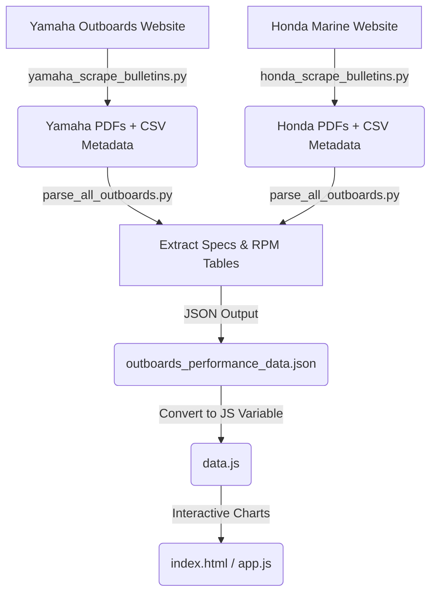

# Outboard Motor Performance Scraper & Viewer

**This app was entirellly vibe coded.**

An end-to-end data pipeline and interactive visual dashboard designed to scrape, parse, and analyze outboard motor performance bulletins from **Yamaha Outboards** and **Honda Marine**. 

The project allows boating enthusiasts, engineers, and researchers to compare RPM vs. Performance curves (Speed, Fuel Consumption, and Fuel Economy) across hundreds of boat models, configurations, hull types, and engine horsepowers.

---

## Architecture Overview



The system is split into three main layers:

1. **Scraping / Crawling**: Multithreaded Python scripts crawl the manufacturers' websites to extract bulletin listings, build progress metadata CSVs, and download original PDF reports.
2. **Parsing / Data Extraction**: A robust PDF parsing engine extracts semi-structured text data, filters out units and noise, and reconstructs RPM tables (mapping RPM to Speed, GPH, and MPG) along with detailed boat, propeller, and engine specifications.
3. **Data Visualization Dashboard**: A client-side web application using HTML5, Vanilla CSS, and Chart.js. The app features powerful search filters, unit conversions, multi-engine normalizations, and interactive performance charts.

---

## 📂 Project Directory Structure

```
outboards_data/
├── index.html                       # Dashboard Main UI Layout
├── style.css                        # Styling for the Dashboard UI
├── app.js                           # Dashboard State, Filters, Charts & Export Logic
├── data.js                          # Preloaded JSON Dataset (bypasses local CORS restrictions)
├── outboards_performance_data.json  # Consolidated Raw Parsed Dataset
├── yamaha_scrape_bulletins.py       # Yamaha Bulletins Scraper & Downloader
├── honda_scrape_bulletins.py        # Honda Bulletins Scraper & Downloader
├── parse_all_outboards.py           # Core PDF Extraction Engine (Extracts Specs & Tables)
├── .gitignore                       # Rules for ignoring downloads/PDFs in Git
├── honda_downloads/                 # [Generated] Honda PDFs and bulletins_metadata.csv
└── yamaha_downloads/                # [Generated] Yamaha PDFs and bulletins_metadata.csv
```

---

## 🚀 Getting Started

### 1. Installation & Requirements

Ensure you have **Python 3.8+** installed. Install the required scraping and parsing dependencies:

```bash
pip install requests beautifulsoup4 pdfplumber pymupdf
```

*Note: PyMuPDF is imported as `fitz` in the parsing script.*

### 2. Scraping Bulletins

The scrapers run concurrently using a thread pool. They support limit boundaries (perfect for quick testing) and output metadata progress to track completed downloads.

#### Yamaha Bulletins
```bash
python yamaha_scrape_bulletins.py --limit 10 --workers 5 --output-dir yamaha_downloads
```

#### Honda Bulletins
```bash
python honda_scrape_bulletins.py --limit 10 --workers 5 --output-dir honda_downloads
```

#### CLI Parameters:
* `--limit <int>`: Cap the number of PDFs downloaded (omitting this downloads all available bulletins).
* `--workers <int>`: Number of concurrent downloader threads (default is `5`).
* `--output-dir <string>`: Output directory for downloaded PDFs and metadata CSVs.

### 3. Parsing PDFs

Once downloads are finished, process the folders to extract RPM performance curves and specifications:

```bash
python parse_all_outboards.py
```

This parses all available PDFs in both `honda_downloads` and `yamaha_downloads` (using `bulletins_metadata.csv` for indexing) in parallel and compiles them into a single file: `outboards_performance_data.json`.

### 4. Updating the Web Viewer Dataset

To run the web app locally from a browser using the `file://` protocol, the web app reads the pre-compiled `data.js` file to avoid CORS restrictions when fetching local JSON files.

To update `data.js` with your newly parsed data, run this simple Python command:

```bash
python -c "import json; d = json.load(open('outboards_performance_data.json', encoding='utf-8')); open('data.js', 'w', encoding='utf-8').write('const outboardsPerformanceData = ' + json.dumps(d) + ';')"
```

---

## 📊 Dashboard Features

Open `index.html` directly in your web browser (no web server required) to launch the viewer.

* **Dual-Manufacturer Data**: Supports side-by-side comparison of Honda and Yamaha engines.
* **Flexible Filters**: Search and select multiple engines, power ratings (HP), outboard configurations (Single/Twin/Triple/Quad), hull designs, and exact boat lengths.
* **Multi-Metric Graphing**: Compare engines by:
  * **Speed (MPH)** vs. RPM
  * **Fuel Flow (GPH)** vs. RPM
  * **Fuel Economy (MPG)** vs. RPM
* **Normalized Fuel Metrics**: Toggle normalization to divide the combined fuel rate or economy by the engine count.
* **Metric/Imperial Toggle**: Swap units on the fly (e.g., MPH vs. KPH, Gallons vs. Litres, Feet vs. Metres).
* **Export Options**: Export the current comparison charts and specifications lists directly into a PDF report or as a standalone HTML file.
